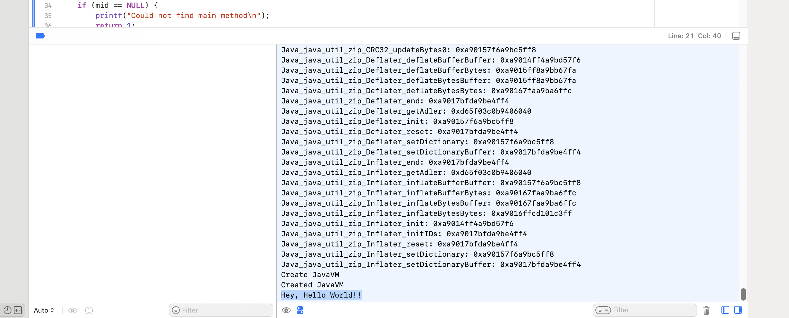

# Run HelloWorld on iOS


- [Create HelloWorld in Java](#create-helloworld-in-java)
- [Create Xcode project](#create-xcode-project)
- [Edit main.c](#edit-mainc)
- [Build or download openjdk/mobile](#build-or-download-openjdkmobile)
    - [Download](#download)
    - [Build](#build)
- [Add framework](#add-framework)
- [Add java.base module](#add-javabase-module)
- [Add libz](#add-libz)
- [Add c++ linker flag](#add-c-linker-flag)
- [Add HelloWorld.jar](#add-helloworldjar)
- [Build and Run](#build-and-run)


## Create HelloWorld in Java

```sh
mkdir helloworld
cd helloworld
```

Create HelloWorld.java:

```sh
echo \
'public class HelloWorld {

    public static void main(String[] args) {
        System.out.println("Hey, Hello World!!");
    }
}
' > HelloWorld.java
```

```sh
javac HelloWorld.java
jar cf HelloWorld.jar HelloWorld.class
cd ..
```


## Create Xcode project

Start Xcode and create a new project, go to menu File -> New -> Project -> tab: iOS -> select App.

Press Next, and fill out the form. e.g.
- Name: HelloMobileApp
- Identifier: com.example.helloworld
- Interface StoryBoard
- Language: Objective-C,  
- Team: "Your name (Personal Team)"

Press next, choose a location and press Create.

The project is created and should like [this](images/helloworld01-project.png).

## Edit main.c

In Xcode in the left navigation, find `main.c` and replace its contents with:

```objc
#import <Foundation/Foundation.h>
#include "jni.h"
#include <stdio.h>
extern void loadfunctions();
int main(int argc, char *argv[]) {
    JavaVM *jvm;
    JNIEnv *env;
    JavaVMInitArgs vm_args;
    JavaVMOption options[2];
    fprintf(stderr, "starting main\n");
    NSString *resourcePath = [[NSBundle mainBundle] resourcePath];
    
    NSString *classPath = [resourcePath stringByAppendingPathComponent:@"HelloWorld.jar"];
    NSString *classPathOption = [NSString stringWithFormat:@"-Djava.class.path=%@", classPath];
    fprintf(stderr, "bcp = %s\n", [classPathOption UTF8String]);
    options[0].optionString = strdup([classPathOption UTF8String]); // Adjust path as needed
    vm_args.version = JNI_VERSION_1_8; // needed to initialize JavaVM
    vm_args.nOptions = 1;
    vm_args.options = options;
    loadfunctions();
    fprintf(stderr, "Create JavaVM\n");
    jint res = JNI_CreateJavaVM(&jvm, (void **)&env, &vm_args);
    fprintf(stderr, "Created JavaVM\n");
    if (res != JNI_OK) {
        printf("Failed to create JVM\n");
        return 1;
    }
    jclass cls = (*env)->FindClass(env, "HelloWorld");
    if (cls == NULL) {
        printf("Could not find HelloWorld class\n");
        return 1;
    }
    jmethodID mid = (*env)->GetStaticMethodID(env, cls, "main", "([Ljava/lang/String;)V");
    if (mid == NULL) {
        printf("Could not find main method\n");
        return 1;
    }
    (*env)->CallStaticVoidMethod(env, cls, mid, NULL);
    (*jvm)->DestroyJavaVM(jvm);
    return 0;
}
```

## Build or download openjdk/mobile

At the end of this step, you’ll have an xcode framework and the java.base module ready to import in Xcode. You can choose to either download it or build it yourself.

### Download

From https://github.com/openjdk-mobile/ios-tools/releases/tag/snapshot download and unpack:
- the [framework](https://github.com/openjdk-mobile/ios-tools/releases/download/snapshot/OpenJDK.xcframework.zip)
- the [java.base module](https://github.com/openjdk-mobile/ios-tools/releases/download/snapshot/java.base-device.zip)

This will result in a directory named `OpenJDK.xcframework`, which is the framework that will be included in Xcode and directory `java.base` that will be needed in one of the next steps.

You can skip the build section and now proceed with [Add framework](#add-framework).

### Build

#### Download or build ffi

Download and unzip
https://github.com/openjdk-mobile/ios-tools/releases/download/libffi-build/libffi-ios.zip

Or if you choose to build ffi, follow [these steps](https://github.com/openjdk-mobile/ios-tools/blob/main/docs/ga/ffi.md).

#### Build openjdk/mobile

Follow the instructions at https://github.com/openjdk/mobile/ to build a static image for iOS.

With JDK 24:

```sh
git clone https://github.com/openjdk/mobile/
cd mobile
sh configure \                                                                                                                      
    --disable-warnings-as-errors \
    --openjdk-target=aarch64-macos-ios \
    --with-libffi-include=_/path/to/support/libffi/include_ \
    --with-libffi-lib=_/path/to/support/libffi/libs_ \
--with-sysroot=/Applications/Xcode.app/Contents/Developer/Platforms/iPhoneOS.platform/Developer/SDKs/iPhoneOS.sdk
```

_(replace /path/to/suport/libffi to the path of the downloaded or built ffi from the step before)_

```sh
make CONF=ios-aarch64-zero-release static-libs-image 
```

### Create the framework

Follow the instructions [here](https://github.com/openjdk-mobile/ios-tools/blob/main/docs/ga/openjdk.md) to create the Xcode framework.


## Add framework

Right click the the HelloMobileApp group ([top level](images/helloworld02-toplevel.png)).

Select the `General` tab in the main window and scroll down to `Frameworks, libraries, and embedded content`. Then click the `+` and in the opened dialog choose Add other -> Add files. 

Find the downloaded or built and unpacked OpenJDK.xcframework and choose Open. The framework will be added and you will see [this](images/helloworld03-framework.png).

## Add java.base module

Right click on HelloMobileApp target ([inner project](images/helloworld04-inner.png)) and select “New Folder” to create a new folder named “lib”. Inside lib, create another folder named “modules”.

Open the Inspectors using the top-right [icon](images/helloworld05-inspector.png) and open the just created lib folder.

In the inspectors at the right, select Build Rules: Apply Once to Folder, and add target HelloMobileApp. It will look like [this](images/helloworld06-lib.png).

Now select the modules directory and right click. Select “Add files to modules”... 
Find the java.base directory (either downloaded and unpacked or built in mobile/build/ios-aarch64-zero-release/jdk/modules/)
Select Copy files to destination.

In the end it will look like [this](images/helloworld07-javabase.png).


## Add libz

This is needed because libzip.a, created from OpenJDK has unresolved symbols that are implemented by libz.

Go to HelloMobileApp in the left navigation, select target HelloMobileApp and open tab Build Phases and expand [Link binary with Libraries](images/helloworld08-libz.png).

Press `+` and search for `libz.tbd` and add it.

## Add c++ linker flag

In the tabs on top of the screen, select Build Settings (next to Build Phases), select “All” in the filter section and scroll down to “Linking - General” and doubleclick in the textfield after “Other Linker Flags” to add the following line:

```
-lc++
```

It will look like [this](images/helloworld09-lcpp.png).


## Add HelloWorld.jar

Select the HelloMobileApp target ([inner project](images/helloworld04-inner.png)).

Right click and select “Add files to “HelloMobileApp”...
Find HelloWorld.jar from the earlier step and add it. Select copy files to destination.

Go to the top level HelloMobileApp again and select Build Phases.
Expand “[Copy Bundle Resources](images/helloworld10-jar.png)” and click + 
Find HelloWorld.jar and add it.


## Build and Run

Xcode will sign your app using the team you selected when you created the app. By default that is the "Your name (Personal Team)" team, which should be more than enough for the purpose of this HelloWorld app.

Build the application (Xcode -> Product -> Build), check the logs.

Then [select your preferred device](images/helloworld12-device.png) to run the application (e.g. "My Mac (Designed for iPad)" or an actual device).

Run the application on your selected device (Xcode -> Product -> Run), and check the Debug Area with the output:



